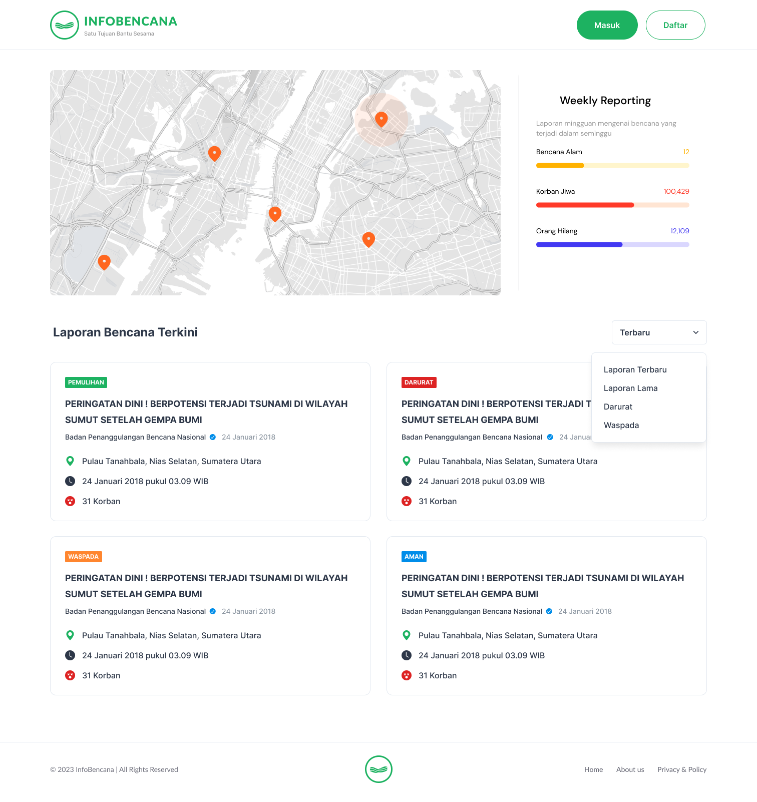

# Infobencana

Infobencana is a platform aimed at providing accurate, timely, and integrated natural disaster information. This platform serves as a solution to the issues often faced by the Indonesian community, such as the lack of access to accurate and timely information during disasters. Infobencana addresses this problem by efficiently integrating, processing, and disseminating relevant and credible natural disaster data. Our goal is to ensure that the public always receives the latest information they need at the right time.

We believe that technology plays a crucial role in helping communities cope with these challenges. Infobencana is our effort to provide informative features, such as disaster maps, lists of missing persons due to disasters, and the latest reports on ongoing natural disasters. We also provide a space for users to discuss, provide input, and facilitate access to donation information for those affected by disasters. Infobencana is dedicated to helping others. We are confident that with accurate information and easy access to the necessary resources, we can work together to overcome natural disaster challenges and ensure the safety of the Indonesian community.

## 📲Preview of InfoBencana - GIGIH 3.0 Capstone Project 2023
  
  
## 📑Table of Contents
- [👊The Team](#the-team)
- [🖥️Repositories](#repositories)
- [How to Run the Project](#how-to-run-the-project)
    - [Step 1: Clone the Repository](#step-1-clone-the-repository)
    - [Step 2: Add Frontend and Backend Repositories](#step-2-add-frontend-and-backend-repositories)
    - [Step 3: Update the Docker Compose Configuration](#step-3-update-the-docker-compose-configuration)
    - [Step 4: Run Docker Compose](#step-4-run-docker-compose)
    - [Step 5: Access the Application](#step-5-access-the-application)
    - [Step 6: Stop Docker Compose](#step-6-stop-docker-compose)

## 👊The Team

|            Member           | Participants ID |        Contacts        |
| :-------------------------: | :--------: | :-----------------------------------------------------------------------------------------------------------------: |
| M Yardan Aqiella        | GG3FSGP0385 |           [LinkedIn](https://www.linkedin.com/in/yardanaqiella/)           |
| Afrinaldi    | GG3FSGP0243 |  [LinkedIn](https://www.linkedin.com/in/afrinaldi-43a086224/)  |
| Zikri Kholifah Nur     | GG3FSUP0150 |   [LinkedIn](https://www.linkedin.com/in/zikrikn/)          |
| Ahmad Indra Nurfauzi | GG3FSGP0249 |  [LinkedIn](https://www.linkedin.com/in/ahmad-indra-nurfauzi/) |

## 🖥️Repositories

|   Learning Paths   |                                Link                                |
| :----------------: | :----------------------------------------------------------------: |
| 🤖 Frontend  |  [Frontend Repository](https://github.com/infobencana/frontend.git) |
| ☁️ Backend  |   [Backend Repository](https://github.com/infobencana/backend.git) |


## ⚙️How to Run the Project

To set up the project and run it using Docker Compose, follow these steps:

### Step 1: Clone the Repository

Clone the main project repository, which includes the `docker-compose.yaml` and `.dockerignore` files:

```bash
git clone https://github.com/infobencana/infobencana-project.git
```

### Step 2: Add Frontend and Backend Repositories

Clone the frontend and backend repositories into the main project folder:

```bash
git clone https://github.com/infobencana/frontend.git
git clone https://github.com/infobencana/backend.git
```

> Note: We have set environment variables in the repository, so you can use them directly without editing the variables.

### Step 3: Update the Docker Compose Configuration

Edit the `docker-compose.yaml` file to configure the backend and frontend services. Make sure to update the environment variables according to your specific requirements.

```yaml
version: '3'
services:
  backend:
    build: ./backend
    ports:
      - "4000:4000"
    environment:
      - MONGO_URL=
      - MONGO_CONNECTION_STRING=
      - PORT=
      - TOKEN_KEY=
      - GCP_PROJECT_ID=
      - GCP_BUCKET_NAME=
      - GCP_PRIVATE_KEY=
      - GCP_CLIENT_EMAIL=

  frontend:
    build: ./frontend
    ports:
      - "80:8080"
    env_file:
      - ./frontend/.env.production
    stdin_open: true
```

Also, edit the `.env.production` file in the frontend folder as needed:

```
VITE_ENDPOINT_URI=http://localhost:4000
VITE_MAP_TILER_KEY=sc4dCeIkcJwfkBZBxeXM
```

### Step 4: Run Docker Compose

Once the configurations are in place, run the following command to start the Docker Compose:

```bash
docker-compose up
```

### Step 5: Access the Application

After the containers are up and running, you can access the integrated application:

- **Frontend:** [http://localhost](http://localhost)
- **Backend:** [http://localhost:4000](http://localhost:4000)

### Step 6: Stop Docker Compose

Once you are done using the application, you can stop the Docker Compose with the following command:

```bash
docker-compose down
```

Make sure you have Docker installed and running on your machine before executing the commands. Adjust the steps based on your specific environment and requirements.

<p align="right">Aye aye aye~ <br/>CPI-FS-SDG-11-A Team</p>